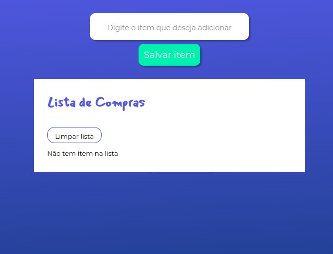

<h1 align="center"> 
    LifeCycle
</h1>

<p align="center">
 <a href="#-sobre-o-projeto">Sobre</a> •
 <a href="#-funcionalidades">Funcionalidades</a> •
 <a href="#-Configuração-do-ambiente">Configuração do ambiente</a> • 
 <a href="#-como-executar">Como executar</a> • 
 <a href="#-tecnologias">Tecnologias</a> 
</p>

---

### 🪐 Sobre o projeto

Este projeto faz parte do curso da Alura e concentra-se no desenvolvimento front-end de um site de lista de tarefas. O objetivo principal é aprofundar o conhecimento nos hooks do Angular 15.

<div align="center">
  
</div>

---

### 💻 Funcionalidades

- [x] **Usuário:**
  - [x] Cadastrar item;
  - [X] Editar;
  - [X] Excluir uma item;
  - [X] Excluir todas as item;

---

### 🎨 Configuração do ambiente

```bash

# Instalar o node na versão a partir da 14.20.x 

## Para instalar o Node.js em sua versão mais recente, siga os passos no site oficial:

https://nodejs.org/pt

# Após a instalação do Node, abra o terminal ou o Prompt de Comando e execute o seguinte comando para instalar o Angular CLI na versão utilizada no curso:

npm install -g @angular/cli@15.x

# Para instalar o Visual Studio Code (VSCode), visite o site oficial e baixe a versão compatível com o seu ambiente de desenvolvimento. Siga as instruções fornecidas para instalar o VSCode em seu sistema:

https://code.visualstudio.com/download
```

### 🚀 Como executar

#### Pré-requisitos

Certifique-se de que todas as configurações do ambiente foram realizadas corretamente.

#### Execução

- Faça o download do projeto para o seu computador.

- Abra o VSCODE.

- No menu principal, selecione a opção “File” e Depois opção "Open Folder". Navegue até a pasta onde o projeto foi baixado e clique em “Selecionar”.

- No projeto aberto, entre no terminal e execute esse comando `ng serve` 

- O projeto vai está disponivel no `http://localhost:4200/`

### 🛠 Tecnologias

#### **Front-End**

- **[JavaScript](https://developer.mozilla.org/pt-BR/docs/Web/JavaScript)**
- **[HTML](https://developer.mozilla.org/pt-BR/docs/Web/HTML)**
- **[CSS](https://developer.mozilla.org/pt-BR/docs/Web/CSS)**
- **[Angular](https://angular.dev)**
